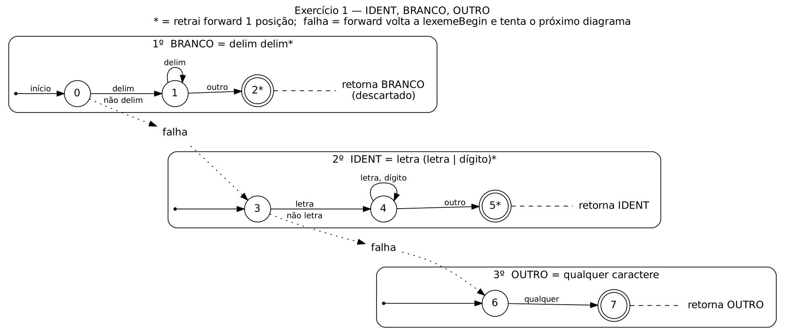
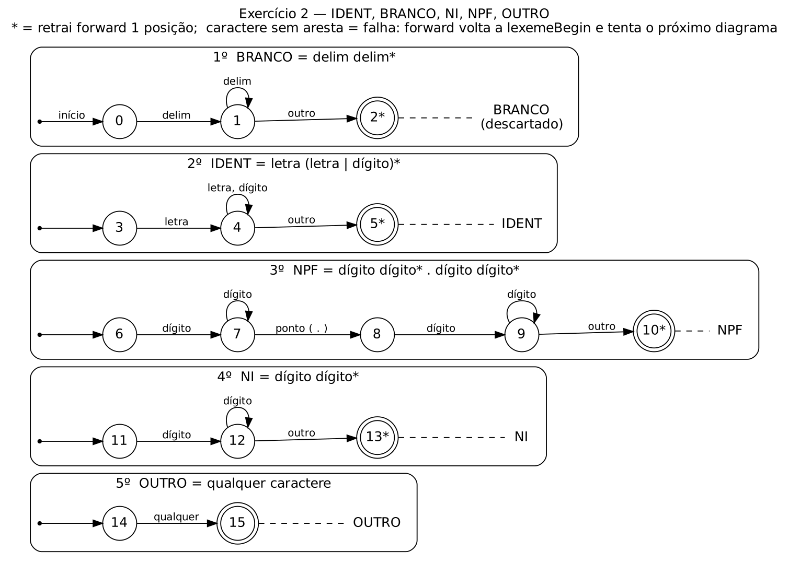

# Analisador léxico baseado em diagramas de transição (INE5622)

Dois exercícios, um por pasta. Cada `lexico.py` é independente (pode ser entregue sozinho),
está todo tipado (anotações de tipo, `Enum`, `dataclass`, `Final`), passa no
`mypy --strict` e roda em Python 3.8 ou mais novo, sem bibliotecas externas.

| Pasta | Tokens | Diagrama |
|---|---|---|
| `ex1_ident_branco_outro/` | IDENT, BRANCO, OUTRO | `diagramas/ex1.png` |
| `ex2_ident_branco_ni_npf_outro/` | IDENT, BRANCO, NI, NPF, OUTRO | `diagramas/ex2.png` |

## Como rodar

```bash
python3 ex1_ident_branco_outro/lexico.py ex1_ident_branco_outro/entrada.txt
python3 ex2_ident_branco_ni_npf_outro/lexico.py ex2_ident_branco_ni_npf_outro/entrada.txt

# também lê da entrada padrão; -l mostra o par <nome, lexema> de cada token
python3 ex2_ident_branco_ni_npf_outro/lexico.py -l < ex2_ident_branco_ni_npf_outro/entrada.txt

bash testar.sh                       # confere as duas saídas contra o enunciado
mypy --strict */lexico.py            # confere a tipagem (pip install mypy)
```

Saída do exercício 2 (idêntica à do enunciado):

```
IDENT IDENT OUTRO OUTRO OUTRO
IDENT IDENT OUTRO
IDENT OUTRO NI OUTRO NPF OUTRO
IDENT OUTRO
OUTRO
```

Com `-l`:

```
<IDENT, def> <IDENT, f> <OUTRO, (> <OUTRO, )> <OUTRO, {>
<IDENT, int> <IDENT, a> <OUTRO, ;>
<IDENT, a> <OUTRO, => <NI, 5> <OUTRO, +> <NPF, 3.9> <OUTRO, ;>
<IDENT, return> <OUTRO, ;>
<OUTRO, }>
```

## Alinhamento com o plano de ensino

O código segue a unidade 4 do plano (Análise Léxica) na ordem em que ela aparece, e usa a
terminologia da bibliografia básica [1] (R. de Santiago, *Anotações para a Disciplina de
Introdução a Compiladores*, cap. 2).

| Plano de ensino | Onde aparece no código |
|---|---|
| 4.4 Expressões regulares | docstring do arquivo: uma ER por token (tabela abaixo) |
| 4.1 Autômatos finitos determinísticos | `DiagramaTransicao`: cada token é um AFD M = (Q, Σ, δ, q0, F), com `inicial` = q0, `delta` = δ e `finais` = F; o alfabeto Σ é particionado em classes (`Classe`) |
| 4.5 Aspectos léxicos de linguagens | `NomeToken` e `Token`: token = par ⟨nome, atributo⟩, com o lexema como atributo [1]; brancos reconhecidos e descartados |
| 4.6 Especificação e implementação do analisador léxico | `AnalisadorLexico`: simula as tabelas de transição sobre a entrada, com os apontadores `lexemeBegin` e `forward` (`BufferEntrada`), como no projeto de analisador léxico de [1] (seção 2.2) |

### Especificação (ER → diagrama)

```
delim  = ' ' | \t | \n | \r | \f | \v
letra  = A | … | Z | a | … | z
dígito = 0 | … | 9
```

| Token | Expressão regular | Estados no diagrama | Ordem de tentativa |
|---|---|---|---|
| BRANCO | `delim delim*` | 0 → 1 → 2* | 1º |
| IDENT | `letra (letra \| dígito)*` | 3 → 4 → 5* | 2º |
| NPF (ex. 2) | `dígito dígito* . dígito dígito*` | 6 → 7 → 8 → 9 → 10* | 3º |
| NI (ex. 2) | `dígito dígito*` | 11 → 12 → 13* | 4º |
| OUTRO | qualquer caractere | 6 → 7 (ex. 1) / 14 → 15 (ex. 2) | último |

`*` no estado final = **retrair**: o caractere que fez sair do laço não pertence ao lexema e
`forward` volta uma posição.

### Diagramas de transição

Exercício 1:



Exercício 2:



### Tabela de transição δ do exercício 2

Linhas = estados; colunas = classes de caracteres. `outro` vale para qualquer classe sem
coluna preenchida; célula vazia sem `outro` = **falha** (`forward` volta a `lexemeBegin` e o
próximo diagrama é tentado).

| Estado | delim | letra | dígito | `.` | outro | Final |
|---|---|---|---|---|---|---|
| 0 | 1 | | | | | |
| 1 | 1 | | | | 2 | |
| 2 | | | | | | BRANCO, retrai |
| 3 | | 4 | | | | |
| 4 | | 4 | 4 | | 5 | |
| 5 | | | | | | IDENT, retrai |
| 6 | | | 7 | | | |
| 7 | | | 7 | 8 | | |
| 8 | | | 9 | | | |
| 9 | | | 9 | | 10 | |
| 10 | | | | | | NPF, retrai |
| 11 | | | 12 | | | |
| 12 | | | 12 | | 13 | |
| 13 | | | | | | NI, retrai |
| 14 | | | | | 15 | |
| 15 | | | | | | OUTRO |

No código, cada linha dessa tabela está em `DIAGRAMA_BRANCO`, `DIAGRAMA_IDENT`,
`DIAGRAMA_NPF`, `DIAGRAMA_NI` e `DIAGRAMA_OUTRO`. No exercício 1, os estados 0–5 são iguais
e OUTRO usa os estados 6 → 7.

### Como a simulação funciona

1. `lexemeBegin` marca o início do lexema e `forward` o próximo caractere. A entrada é lida
   **um caractere por vez** (`read(1)`). Se `forward` volta, a releitura vem do buffer, não
   da entrada.
2. Para cada diagrama, na ordem da tabela, o simulador parte de q0 e segue δ caractere a
   caractere até chegar a um estado final, ou até não haver aresta (falha).
3. Num estado final: se ele tem `*`, `forward` recua uma posição. O lexema é o trecho entre
   `lexemeBegin` e `forward`, o token ⟨nome, lexema⟩ é emitido, e `lexemeBegin` passa a
   valer `forward`.
4. Na falha, `forward` volta a `lexemeBegin` e o próximo diagrama é tentado. NPF vem antes
   de NI: em `5;` o diagrama NPF falha no estado 7 (não há ponto) e o NI reconhece `5`. Se
   NI viesse primeiro, `3.9` sairia como `NI OUTRO NI`.
5. Tokens BRANCO são descartados da lista. Ao final, a lista é escrita na tela, quebrando a
   linha como no código-fonte (cada token guarda a linha em que começa).

## Definições adotadas (mude se o professor definir diferente)

| Item | Escolha | Onde mudar |
|---|---|---|
| letra | só `A–Z` e `a–z`, como em "id: letra seguida de letras ou dígitos" [1] | `classificar()` |
| `_` e letras acentuadas | não são letra: viram OUTRO | `classificar()` |
| NPF | `dígito⁺ . dígito⁺`, sem expoente | `DIAGRAMA_NPF` |
| OUTRO | um caractere por token (`==` dá dois OUTRO) | `DIAGRAMA_OUTRO` |

Casos de borda testados (exercício 2):

| Entrada | Tokens |
|---|---|
| `5.` | `NI OUTRO` (falha no estado 8: falta dígito depois do ponto) |
| `.5` | `OUTRO NI` |
| `3.14.15` | `NPF OUTRO NI` |
| `x1 1x` | `IDENT NI IDENT` |
| `a_b` | `IDENT OUTRO IDENT` |
| `ção` | `OUTRO OUTRO IDENT` |
| arquivo vazio, só brancos, sem `\n` no fim, CRLF | funcionam sem erro |

No exercício 1 não há token numérico, então cada dígito solto vira OUTRO.

## Arquivos

```
analisador-lexico-diagramas/
├── README.md
├── testar.sh
├── diagramas/        ex1/ex2 em .dot (fonte), .png e .svg
├── ex1_ident_branco_outro/
│   ├── lexico.py
│   ├── entrada.txt
│   └── saida_esperada.txt
└── ex2_ident_branco_ni_npf_outro/
    ├── lexico.py
    ├── entrada.txt
    └── saida_esperada.txt
```

Para redesenhar os diagramas: `dot -Tpng diagramas/ex1.dot -o diagramas/ex1.png`.
